<h1 align="center">
    
</h1>

 
   

<h2 align="left">🥇 Trophies</h2>

  

<h2 align="left">🚀 Languages and Tools</h2>

  

  <h2 align="left">🐍 My Contributions</h2>
  
   

<h2 align="left">📊 Stats</h2>

    
    
    

<h2 align="left">🔗 Links</h2>
<table>
  <tr>
    <td></td>
    <td></td>
    <td></td>
  </tr>
</table>
